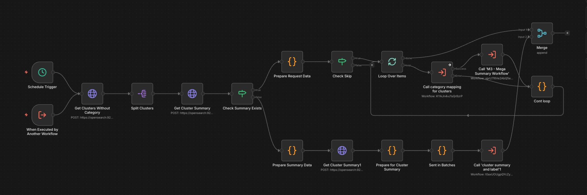

# M3 Categorize Clusters Workflow - Technical Overview

## Purpose
Automated cluster categorization system that assigns semantic categories to uncategorized clusters and generates mega summaries for each category using cluster summaries as input.  
Also see: `M3_Category_Mapping_For_Clusters.md` for per-cluster category assignment logic and `M3_Cluster_Summary_And_Label.md` / `M3_Mega_Summary_Workflow.md` / `M3_Mega_Summary_Sub_Workflow.md` for the supporting summary and mega-summary flows.

---

## Core Flow

```
1. Fetch uncategorized clusters from OpenSearch (clusters without 'category' field)
2. For each cluster:
   ├─ Fetch cluster summary from cluster_summaries index
   ├─ If summary exists: Call categorization API
   ├─ If no summary: Generate summary first via sub-workflow
   └─ Update cluster document with assigned category
3. After categorization: Generate mega summaries
   ├─ Extract categories and their cluster IDs
   ├─ Fetch cluster summaries for each category
   ├─ Call mega summary API per category
   └─ Save mega summaries to OpenSearch
```

---

## Visual Flow

```
START
  → Get uncategorized clusters
  → Split into individual items
  → For each cluster:
      → Get cluster summary
      → Check if summary exists
        ├─ YES: Prepare request → Loop processing → Call categorization
        └─ NO: Prepare summary data → Call summary generation sub-workflow
      → Update cluster with category
  → Merge results
  → Extract categories with cluster IDs
  → For each category (parallel):
      → Get cluster summaries from OpenSearch
      → Build cluster summaries map
      → Call mega summary API
      → Add category name to response
      → Save mega summary to OpenSearch
      → Log success
END
```

Visual overview:



---

## Technical Details

### Data Sources
- **Input:** `clusters` index (filters clusters without category field using `must_not exists` query)
- **Cluster Summaries:** `cluster_summaries` index (matched by `cluster_id`)
- **Output:**
  - Updated `clusters` index (with `category` field)
  - `mega_summaries` index (new documents per category)

### API Integration
- **Categorization Endpoint:** Sub-workflow "category mapping for clusters" (ID: `KYAJn4vJ1sQr8zrP`)
- **Summary Generation:** Sub-workflow "cluster summary and label" (ID: `t0axUOUgpQYcZyXC`)
- **Mega Summary Endpoint:** `POST {{ $env.BACKEND_URL }}/mega_summary_from_clusters`

### Processing Modes
- **Path A (Has Summary):** cluster → categorization → update
- **Path B (No Summary):** cluster → generate summary → categorization → update
- **Path C (Mega Summary):** categories → fetch summaries → generate mega summary → save

### Query Structure

**Fetch Uncategorized Clusters:**
```json
{
  "query": {
    "bool": {
      "must_not": {
        "exists": {
          "field": "category"
        }
      }
    }
  },
  "_source": ["cluster_id", "article_count", "article_ids"],
  "size": 1000
}
```

**Fetch Cluster Summary by ID:**
```json
{
  "query": {
    "term": {
      "cluster_id": "{{ cluster_id }}"
    }
  },
  "_source": ["summary", "topic_label", "article_count", "article_ids", "cluster_id"],
  "size": 1
}
```

**Fetch Summaries for Category:**
```json
{
  "query": {
    "terms": {
      "cluster_id": [/* array of cluster IDs */]
    }
  },
  "_source": ["cluster_id", "summary"],
  "size": 1000
}
```

---

## Key Algorithms

### 1. Data Preparation & Validation
```javascript
// Validate cluster_id before processing
let clusterId = summaryDoc.cluster_id || clusterDoc.cluster_id;

// Skip invalid cluster IDs instead of throwing errors
if (clusterId === null || clusterId === undefined || clusterId === '' || isNaN(clusterId)) {
  return {
    json: {
      skip: true,
      reason: 'invalid_cluster_id',
      _cluster_doc_id: docId,
      cluster_id: null
    }
  };
}

// Parse and validate
clusterId = parseInt(clusterId, 10);

// Clean summary text
summary = summary
  .replace(/[\r\n]+/g, ' ')
  .replace(/\s+/g, ' ')
  .trim();
```

### 2. Category Extraction for Mega Summary
```javascript
// Extract categories from categorization response
const categoriesData = input.categories;

// Convert to array (one item per category)
const categoryItems = [];

for (const [categoryName, categoryData] of Object.entries(categoriesData)) {
  const clusters = categoryData.clusters || [];
  const clusterIds = clusters.map(c => c.cluster_id);
  
  if (clusterIds.length === 0) continue;
  
  categoryItems.push({
    category_name: categoryName,
    cluster_ids: clusterIds,
    request_id: input.request_id || `req_${Date.now()}`
  });
}

// Return array - n8n creates separate items for parallel processing
return categoryItems;
```

### 3. Cluster Summaries Map Building
```javascript
// Build map from OpenSearch response
const clusterSummaries = {};

if (input.hits && input.hits.hits && input.hits.hits.length > 0) {
  input.hits.hits.forEach(hit => {
    const source = hit._source;
    if (source.cluster_id && source.summary) {
      clusterSummaries[source.cluster_id] = source.summary;
    }
  });
}

// Prepare for API call
return [{
  json: {
    request_id: previousNode.request_id,
    category_name: previousNode.category_name,
    cluster_ids: previousNode.cluster_ids,
    cluster_summaries: clusterSummaries
  }
}];
```

### 4. Batch Processing for Summary Generation
```javascript
const BATCH_SIZE = 5; // Clusters per batch
const totalBatches = Math.ceil(clusters.length / BATCH_SIZE);

const batches = [];
for (let i = 0; i < clusters.length; i += BATCH_SIZE) {
  const batchClusters = clusters.slice(i, i + BATCH_SIZE);
  const batchArticleIds = [...new Set(batchClusters.flatMap(c => c.article_ids))];
  
  batches.push({
    batch_number: Math.floor(i / BATCH_SIZE) + 1,
    total_batches: totalBatches,
    request_id: `${input.request_id}_batch_${batchNum}`,
    clusters: batchClusters,
    articles: batchArticles.filter(a => batchArticleIds.includes(a.id)),
    article_summaries: /* filtered summaries */
  });
}

return batches; // Parallel processing
```

---

## Configuration

| Parameter | Value | Location |
|-----------|-------|----------|
| Max Clusters Fetched | 1000 | Get Clusters Without Category |
| Loop Batch Size | 3 items | Loop Over Items node |
| Summary Batch Size | 5 clusters | Sent in Batches node |
| Wait for Sub-workflow | true (categorization)<br>false (summary gen) | Sub-workflow nodes |
| Mega Summary Max Results | 1000 summaries | Get Cluster Summaries |

---

## Data Structures

### Cluster Document (Before)
```json
{
  "_id": "n8n_incr_..._001_0",
  "cluster_id": "0",
  "article_ids": ["ntv-123", "ntv-456"],
  "article_count": 2,
  "centroid_embedding": [384 floats],
  "status": "active"
  // NO category field
}
```

### Cluster Document (After)
```json
{
  "_id": "n8n_incr_..._001_0",
  "cluster_id": "0",
  "article_ids": ["ntv-123", "ntv-456"],
  "article_count": 2,
  "centroid_embedding": [384 floats],
  "status": "active",
  "category": "Politics"  // ADDED
}
```

### Cluster Summary Document
```json
{
  "_id": "summary_doc_id",
  "cluster_id": "0",
  "summary": "Brief overview of cluster content...",
  "topic_label": "Election Coverage",
  "article_count": 2,
  "article_ids": ["ntv-123", "ntv-456"]
}
```

### Mega Summary Document
```json
{
  "_id": "auto_generated",
  "request_id": "req_1234567890",
  "category_name": "Politics",
  "mega_summary": "Comprehensive summary of all political clusters...",
  "cluster_count": 15,
  "cluster_ids": ["0", "3", "7", ...],
  "processed_at": "2026-02-10T14:30:00Z",
  "ingested_at": "2026-02-10T14:30:05Z"
}
```

### Categorization Request
```json
{
  "cluster_id": 0,
  "summary": "Clean single-line summary text",
  "topic_label": "Optional topic",
  "article_count": 2,
  "article_ids": ["ntv-123", "ntv-456"],
  "_cluster_doc_id": "n8n_incr_..._001_0"
}
```

### Mega Summary Request
```json
{
  "request_id": "req_1234567890",
  "cluster_summaries": {
    "0": "Summary for cluster 0...",
    "3": "Summary for cluster 3...",
    "7": "Summary for cluster 7..."
  }
}
```

---

## Workflow Architecture

### Sequential Processing
Clusters are processed one-by-one through a loop to ensure:
- Controlled resource usage
- Proper error handling per cluster
- Detailed logging per item

### Parallel Mega Summary Generation
After categorization completes:
- Categories are extracted into separate items
- Each category processes independently (parallel branches)
- All categories generate mega summaries simultaneously

### Conditional Paths
**Path Selection Logic:**
- Summary Exists → Direct to categorization
- No Summary → Generate summary first → Categorization
- Invalid Cluster ID → Skip with logging

---

## Performance Characteristics

- **Throughput:** Depends on number of uncategorized clusters and LLM response time
- **Sequential Loop:** One cluster at a time for categorization
- **Parallel Execution:** Multiple categories generate mega summaries simultaneously
- **Error Handling:**
  - `continueErrorOutput` for categorization sub-workflow
  - Skip invalid cluster IDs without failing workflow
- **Fault Tolerance:** Invalid cluster IDs are logged and skipped

---

## Dependencies

- **n8n:** v2.4.6+
- **OpenSearch:** Indices required:
  - `clusters` (read/write)
  - `cluster_summaries` (read)
  - `mega_summaries` (write)
- **Sub-workflows:**
  - "category mapping for clusters" (ID: `KYAJn4vJ1sQr8zrP`)
  - "cluster summary and label" (ID: `t0axUOUgpQYcZyXC`)
- **Backend API:** Must support `/mega_summary_from_clusters` endpoint

---

## Workflow Execution Path

```
START
  → Manual trigger or scheduled
  → Get Clusters Without Category (OpenSearch query)
  → Split Clusters (array to individual items)
  
  FOR EACH CLUSTER:
    → Get Cluster Summary (by cluster_id)
    → Check Summary Exists
    
    IF SUMMARY EXISTS:
      → Prepare Request Data
      → Validate cluster_id
      → Check Skip (if invalid)
      → Loop Over Items (sequential, batch size 3)
      → Call category mapping sub-workflow (wait=true)
      → Continue loop
    
    IF NO SUMMARY:
      → Prepare Summary Data
      → Get articles for cluster
      → Prepare for Cluster Summary
      → Sent in Batches (5 clusters per batch)
      → Call 'cluster summary and label' sub-workflow (wait=false)
      → Merge results
  
  AFTER ALL CATEGORIZATION:
    → Extract Categories with Cluster IDs (convert to array)
    
    FOR EACH CATEGORY (PARALLEL):
      → Get Cluster Summaries from OpenSearch
      → Build Cluster Summaries Map
      → Call Mega Summary API
      → Add Category Name to Response
      → Save Mega Summary to OpenSearch
      → Log Mega Summary Success
  
END
```

---

## Critical Implementation Notes

1. **Cluster ID Validation:** Must validate and parse `cluster_id` before processing to avoid NaN errors
2. **Skip Logic:** Returns skip object instead of throwing errors for invalid data
3. **Sequential Categorization:** Loop ensures controlled processing, batch size = 3
4. **Parallel Mega Summaries:** Each category processes independently after categorization
5. **Summary Fallback:** Automatically generates summaries for clusters that don't have them
6. **Text Cleaning:** Removes newlines and normalizes whitespace in summaries
7. **Sub-workflow Sync:** Categorization waits for completion (`wait=true`), summary generation doesn't (`wait=false`)

---

## Error Handling

| Error Scenario | Handling Strategy |
|----------------|-------------------|
| Missing cluster_id | Skip cluster, log warning, continue |
| cluster_id is NaN | Skip cluster, log warning, continue |
| No cluster summary | Trigger summary generation sub-workflow |
| Categorization API fails | `continueErrorOutput` - process continues |
| No categories returned | Log warning, empty array, skip mega summary |
| No summaries for category | Continue anyway, API handles empty map |
| OpenSearch insert fails | Log error, continue processing |

---

## Monitoring & Logging

**Key Metrics:**
- Total clusters fetched: Count from OpenSearch query
- Skipped clusters: Count of invalid `cluster_id`
- Categorized clusters: Count of successful categorization calls
- Categories generated: Count from extracted categories
- Mega summaries created: Count of saved documents

**Debug Logs:**
```
⚠️ SKIPPING cluster with invalid ID: {id}
⚠️ SKIPPING cluster - cluster_id is NaN: {id}
⚠️ No categories found in response
⚠️ Skipping category "{name}" - no clusters
📊 EXTRACTED {n} CATEGORIES FOR MEGA SUMMARY
📊 CLUSTER SUMMARIES FOR: {category}
Requested: {n} cluster IDs
Found: {n} summaries in OpenSearch
Missing: {n}
✅ MEGA SUMMARY GENERATED FOR: {category}
💾 SAVED MEGA SUMMARY TO OPENSEARCH
```

**Progress Tracking:**
- Batch progress: `{batch_num}/{total_batches}`
- Per category: Cluster count, summary length
- Per mega summary: Request ID, document ID, index result

---

## Data Flow Diagram

```
┌─────────────────────────────────────────────────┐
│         Clusters Index (uncategorized)          │
└─────────────────────┬───────────────────────────┘
                      │
                      ▼
         ┌────────────────────────┐
         │   Split into Items     │
         └──────────┬─────────────┘
                    │
        ┌───────────┴────────────┐
        │                        │
        ▼                        ▼
┌──────────────┐        ┌──────────────┐
│Has Summary?  │        │ No Summary?  │
└──────┬───────┘        └──────┬───────┘
       │                       │
       │              ┌────────▼────────┐
       │              │Generate Summary │
       │              │  (Sub-workflow) │
       │              └────────┬────────┘
       │                       │
       └───────────┬───────────┘
                   │
                   ▼
        ┌────────────────────┐
        │   Categorization   │
        │   (Sub-workflow)   │
        └──────────┬─────────┘
                   │
                   ▼
        ┌────────────────────┐
        │ Update Cluster Doc │
        │  (Add Category)    │
        └──────────┬─────────┘
                   │
                   ▼
        ┌────────────────────┐
        │Extract Categories  │
        │   & Cluster IDs    │
        └──────────┬─────────┘
                   │
        ┌──────────┴────────────┐
        │  (Parallel per        │
        │   category)           │
        ▼                       ▼
┌──────────────┐      ┌──────────────┐
│ Fetch        │      │ Fetch        │
│ Summaries    │      │ Summaries    │
└──────┬───────┘      └──────┬───────┘
       │                     │
       ▼                     ▼
┌──────────────┐      ┌──────────────┐
│ Build Map    │      │ Build Map    │
└──────┬───────┘      └──────┬───────┘
       │                     │
       ▼                     ▼
┌──────────────┐      ┌──────────────┐
│ Call Mega    │      │ Call Mega    │
│ Summary API  │      │ Summary API  │
└──────┬───────┘      └──────┬───────┘
       │                     │
       ▼                     ▼
┌──────────────┐      ┌──────────────┐
│ Save to OS   │      │ Save to OS   │
└──────────────┘      └──────────────┘
```

---

## Optimization Opportunities

- **Parallel Categorization:** Currently sequential (loop), could parallelize with proper resource management
- **Cache Summaries:** Reuse fetched summaries to avoid duplicate OpenSearch calls
- **Batch Updates:** Update multiple cluster documents in bulk instead of one-by-one
- **Category Pre-filtering:** Skip mega summary generation for categories with < N clusters
- **Rate Limiting:** Add delays between API calls if backend has rate limits

---

## Version
- **Workflow:** v6.0
- **File:** `M3_-_Categorize_Clusters_Workflow__6_.json`
- **Updated:** 2026-02-10
