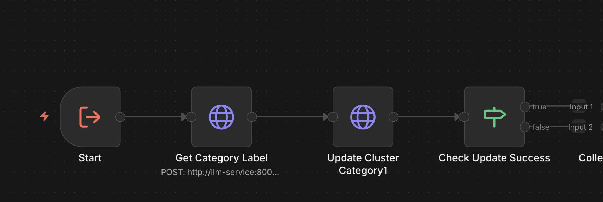

# M3 Category Mapping for Clusters - Technical Overview

## Purpose
Sub-workflow that assigns semantic categories to clusters using LLM-based categorization. Called by the categorize clusters workflow to process individual clusters.

---

## Core Flow

```
1. Receive cluster data (cluster_id, summary, article_ids, etc.)
2. Call LLM category_label endpoint to get category assignment
3. Update cluster document in OpenSearch with assigned category
4. Check if update was successful
5. Collect success results
```

---

## Visual Flow

```
START (Execute Workflow Trigger)
  → Get Category Label (LLM /category_label)
  → Update Cluster Category1 (OpenSearch update)
  → Check Update Success (if result == "updated")
  → Collect Success Results (merge)
END
```

Visual overview:



---

## Technical Details

### Input Format
This workflow is triggered by other workflows (sub-workflow). Expected input:
```json
{
  "_cluster_doc_id": "n8n_incr_..._001_0",
  "cluster_id": 0,
  "summary": "Clean summary text...",
  "article_count": 2,
  "article_ids": ["id1", "id2"]
}
```

### LLM Integration
- **Endpoint:** `POST http://llm-service:8001/category_label`
- **Payload:**
  ```json
  {
    "request_id": "{_cluster_doc_id}",
    "summary": "Clean summary text (newlines removed, quotes escaped)",
    "article_count": 2,
    "article_ids": ["id1", "id2"],
    "cluster_id": 0
  }
  ```
- **Response:** Contains `category` field with assigned category name

### OpenSearch Update
```json
POST /clusters/_update/{_cluster_doc_id}
{
  "doc": {
    "category": "Politics",
    "updated_at": "2026-02-11T06:27:38.322Z"
  }
}
```

### Success Check
- Checks if OpenSearch update result equals `"updated"`
- Only successful updates proceed to collection

---

## Configuration

| Parameter | Value | Location |
|-----------|-------|----------|
| Success Condition | `result == "updated"` | Check Update Success |
| Merge Mode | `combine` (multiplex) | Collect Success Results |

---

## Data Structures

### Input (from calling workflow)
```json
{
  "_cluster_doc_id": "n8n_incr_2026-02-11_0627_001_0",
  "cluster_id": 0,
  "summary": "Summary text with newlines\nand quotes\"",
  "article_count": 2,
  "article_ids": ["id1", "id2"]
}
```

### Category Label Request
```json
{
  "request_id": "n8n_incr_2026-02-11_0627_001_0",
  "summary": "Summary text with newlines and quotes",
  "article_count": 2,
  "article_ids": ["id1", "id2"],
  "cluster_id": 0
}
```

### Category Label Response
```json
{
  "category": "Politics",
  "request_id": "n8n_incr_2026-02-11_0627_001_0"
}
```

### OpenSearch Update Response
```json
{
  "_index": "clusters",
  "_id": "n8n_incr_2026-02-11_0627_001_0",
  "result": "updated",
  "_version": 2
}
```

---

## Workflow Execution Path

```
START (Execute Workflow Trigger)
  → Get Category Label
    ├─ Clean summary text (remove newlines, escape quotes)
    ├─ Call LLM /category_label endpoint
    └─ Receive category assignment
  → Update Cluster Category1
    ├─ Update cluster document in OpenSearch
    └─ Add category and updated_at fields
  → Check Update Success
    ├─ IF result == "updated": Continue
    └─ ELSE: Stop (no output)
  → Collect Success Results
    └─ Merge successful updates
END
```

---

## Critical Implementation Notes

1. **Sub-workflow Design:** Designed to be called by other workflows, not triggered directly
2. **Text Cleaning:** Summary text is cleaned before sending to LLM:
   - Newlines replaced with spaces
   - Quotes escaped for JSON safety
3. **Request ID:** Uses `_cluster_doc_id` as request_id for tracking
4. **Success Validation:** Only processes successful updates (`result == "updated"`)
5. **Error Handling:** Failed updates don't produce output (filtered by Check Update Success)

---

## Error Handling

| Error Scenario | Handling Strategy |
|----------------|-------------------|
| LLM category_label fails | Workflow fails, no category assigned |
| OpenSearch update fails | Check Update Success filters out failed updates |
| Missing summary field | LLM call may fail or return empty category |
| Invalid cluster_id | LLM may still process, but update may fail |

---

## Monitoring

**Key Metrics:**
- Category assignment success: Check `clusters` index for `category` field
- Update success rate: Compare successful vs failed updates
- Processing time: Check `updated_at` timestamps

**Debug Logs:**
- No explicit debug logs in this workflow
- Check OpenSearch update results for success/failure

---

## Dependencies

- **n8n:** v2.4.6+
- **OpenSearch:** Index: `clusters` (read/write)
- **LLM Service:** Must support `/category_label` endpoint

---

## Integration Points

### Called By
- M3 - Categorize Clusters Workflow (for each uncategorized cluster)

### Calls
- None (standalone sub-workflow)

---

## Version
- **Workflow:** v1.0
- **File:** `KYAJn4vJ1sQr8zrP.json`
- **Updated:** 2026-02-11
