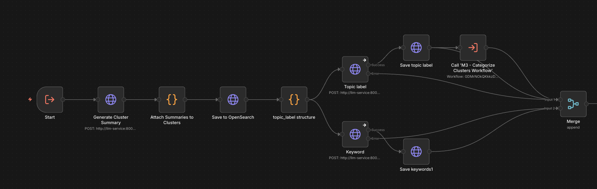

# M3 Cluster Summary and Label - Technical Overview

## Purpose
Sub-workflow that generates cluster summaries, topic labels, and keywords for clusters. Called by other workflows when clusters need summaries and labels generated. After completion, triggers the categorization workflow.

---

## Core Flow

```
1. Receive input from calling workflow (articles/clusters data)
2. Call LLM cluster_summarize endpoint to generate summary
3. Format response and save summary to cluster_summaries index
4. In parallel:
   ├─ Generate topic label via LLM topic_label endpoint
   └─ Extract keywords via LLM keyword_extract endpoint
5. Save topic label to cluster_summaries document
6. Save keywords to keywords index
7. Merge results and trigger categorization workflow
```

---

## Visual Flow

```
START (Execute Workflow Trigger)
  → Generate Cluster Summary (LLM /cluster_summarize)
  → Attach Summaries to Clusters (format response)
  → Save to OpenSearch (cluster_summaries index)
  → topic_label structure (prepare payload)
    ├─ Topic label (LLM /topic_label) → Save topic label → Call Categorize Workflow
    └─ Keyword (LLM /keyword_extract) → Save keywords1
  → Merge (combine results)
END
```

Visual overview:



---

## Technical Details

### Input Format
This workflow is triggered by other workflows (sub-workflow). Expected input contains:
- Articles data
- Cluster information
- Request metadata

### LLM Integration

**1. Cluster Summary Generation**
- **Endpoint:** `POST http://llm-service:8001/cluster_summarize`
- **Payload:** Passed through from calling workflow
- **Response Format:**
  ```json
  {
    "request_id": "...",
    "clusters": [{
      "cluster_id": "0",
      "article_ids": ["id1", "id2"],
      "article_count": 2,
      "summary": "Generated summary text..."
    }],
    "processed_at": "2026-02-11T10:34:44.328Z"
  }
  ```
- **Timeout:** 50 minutes (3000000ms)

**2. Topic Label Generation**
- **Endpoint:** `POST http://llm-service:8001/topic_label`
- **Payload:**
  ```json
  {
    "request_id": "label_{cluster_id}_{timestamp}",
    "summary": "Cluster summary text..."
  }
  ```
- **Response:** Contains `topic_label` field
- **Error Handling:** `continueErrorOutput` - continues even if fails

**3. Keyword Extraction**
- **Endpoint:** `POST http://llm-service:8001/keyword_extract`
- **Payload:**
  ```json
  {
    "request_id": "label_{cluster_id}_{timestamp}",
    "summary": "Cluster summary text..."
  }
  ```
- **Response:** Contains `lda_keywords` array
- **Error Handling:** `continueErrorOutput` - continues even if fails

### OpenSearch Operations

**1. Save Cluster Summary**
```json
POST /cluster_summaries/_doc/{cluster_id}
{
  "cluster_id": "0",
  "request_id": "...",
  "article_ids": ["id1", "id2"],
  "article_count": 2,
  "summary": "Generated summary...",
  "ingested_at": "2026-02-11T10:34:44.328Z",
  "processed_at": "2026-02-11T10:34:44.328Z"
}
```

**2. Update Topic Label**
```json
POST /cluster_summaries/_update/{cluster_id}
{
  "doc": {
    "topic_label": "Election Coverage",
    "label_processed_at": "2026-02-11T10:34:45.000Z"
  }
}
```

**3. Save Keywords**
```json
PUT /keywords/_doc/{cluster_id}
{
  "lda_keywords": ["keyword1", "keyword2", ...],
  "processed_at": "2026-02-11T10:34:45.000Z",
  "article_ids": ["0"],
  "request_id": "label_0_..."
}
```

---

## Configuration

| Parameter | Value | Location |
|-----------|-------|----------|
| Cluster Summary Timeout | 50 minutes | Generate Cluster Summary |
| Topic Label Timeout | Default | Topic label |
| Keyword Extract Timeout | Default | Keyword |
| Error Handling | `continueErrorOutput` | Topic label, Keyword |

---

## Data Structures

### Input (from calling workflow)
```json
{
  "articles": [...],
  "clusters": [...],
  "request_id": "...",
  // ... other fields from calling workflow
}
```

### Cluster Summary Response
```json
{
  "cluster_id": "0",
  "request_id": "req_1234567890",
  "article_ids": ["id1", "id2"],
  "article_count": 2,
  "summary": "Generated summary text...",
  "ingested_at": "2026-02-11T10:34:44.328Z",
  "processed_at": "2026-02-11T10:34:44.328Z"
}
```

### Topic Label Payload
```json
{
  "request_id": "label_0_1739277284328",
  "summary": "Generated summary text...",
  "cluster_id": "0"
}
```

### Topic Label Response
```json
{
  "topic_label": "Election Coverage",
  "processed_at": "2026-02-11T10:34:45.000Z",
  "request_id": "label_0_1739277284328"
}
```

### Keyword Response
```json
{
  "lda_keywords": ["election", "vote", "politics", ...],
  "processed_at": "2026-02-11T10:34:45.000Z",
  "request_id": "label_0_1739277284328"
}
```

### Final Cluster Summary Document
```json
{
  "cluster_id": "0",
  "request_id": "req_1234567890",
  "article_ids": ["id1", "id2"],
  "article_count": 2,
  "summary": "Generated summary text...",
  "topic_label": "Election Coverage",
  "ingested_at": "2026-02-11T10:34:44.328Z",
  "processed_at": "2026-02-11T10:34:44.328Z",
  "label_processed_at": "2026-02-11T10:34:45.000Z"
}
```

---

## Workflow Execution Path

```
START (Execute Workflow Trigger)
  → Generate Cluster Summary
    ├─ Call LLM /cluster_summarize endpoint
    └─ Receive cluster summary response
  → Attach Summaries to Clusters
    ├─ Extract first cluster from response
    └─ Format for OpenSearch
  → Save to OpenSearch
    └─ Create/update cluster_summaries document
  → topic_label structure
    ├─ Prepare topic label payload
    └─ Split into two parallel branches:
        ├─ Branch A: Topic label
        │   → Call LLM /topic_label endpoint
        │   → Save topic label (update cluster_summaries)
        │   → Call Categorize Clusters Workflow
        └─ Branch B: Keyword
            → Call LLM /keyword_extract endpoint
            → Save keywords (create keywords document)
  → Merge (combine both branches)
END
```

---

## Critical Implementation Notes

1. **Sub-workflow Design:** Designed to be called by other workflows, not triggered directly
2. **Single Cluster Processing:** Extracts first cluster from LLM response (`clusters[0]`)
3. **Parallel Processing:** Topic label and keyword extraction run simultaneously after summary is saved
4. **Error Tolerance:** Both topic label and keyword extraction use `continueErrorOutput` to prevent workflow failure
5. **Automatic Categorization:** After topic label is saved, automatically calls the categorize clusters workflow
6. **Request ID Format:** Topic label request ID format: `label_{cluster_id}_{timestamp}`

---

## Error Handling

| Error Scenario | Handling Strategy |
|----------------|-------------------|
| LLM cluster_summarize fails | Workflow fails, no summary saved |
| LLM topic_label fails | `continueErrorOutput` - continues, no label saved |
| LLM keyword_extract fails | `continueErrorOutput` - continues, no keywords saved |
| OpenSearch save fails | Workflow fails at that step |
| Missing cluster in response | Workflow may fail if `clusters[0]` is undefined |
| Missing summary field | Topic label/keyword calls will fail gracefully |

---

## Monitoring

**Key Metrics:**
- Summary generation success: Check `cluster_summaries` index for new documents
- Topic label success: Check for `topic_label` field in `cluster_summaries`
- Keyword extraction success: Check `keywords` index for new documents
- Processing time: Compare `processed_at` vs `label_processed_at` timestamps

**Debug Logs:**
```
🏷️ Returning topic_label payload for cluster {cluster_id}
```

---

## Dependencies

- **n8n:** v2.4.6+
- **OpenSearch:** Indices: `cluster_summaries` (read/write), `keywords` (write)
- **LLM Service:** Must support:
  - `/cluster_summarize` endpoint
  - `/topic_label` endpoint
  - `/keyword_extract` endpoint
- **Sub-workflow:** Calls "M3 - Categorize Clusters Workflow" (ID: `GDMrNOkQKkkzD4rwUO5cl`)

---

## Integration Points

### Called By
- M3 - Categorize Clusters Workflow (when clusters need summaries)
- Other workflows that need cluster summaries and labels

### Calls
- M3 - Categorize Clusters Workflow (after topic label is saved)

---

## Version
- **Workflow:** v1.0
- **File:** `t0axUOUgpQYcZyXC.json`
- **Updated:** 2026-02-11
