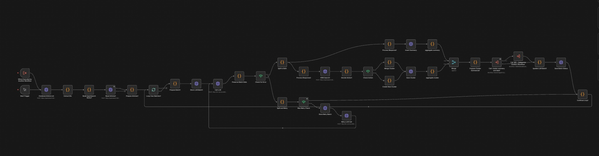

# M3 Clustering + Summary + Label - Technical Overview

## Purpose
Comprehensive workflow that performs clustering, summary generation, and labeling for articles. It is an extended version of **M3 Incremental Clustering with KNN Similarity**, reusing the same KNN-based merge/create logic (k=20, similarity threshold=0.75, 384‑dim `centroid_embedding`) and adding integrated summary + labeling steps on top. Processes unclustered articles in batches, creates clusters via LLM, generates summaries and labels, and saves everything to OpenSearch. Includes retry logic for failed batches.  
Also see: `M3_Cluster_Summary_And_Label.md` for the sub-workflow that generates per-cluster summaries, labels, and keywords.

---

## Core Flow

```
1. Get clustered article IDs from OpenSearch
2. Build query to fetch unclustered articles
3. Process articles in batches (20 articles per batch)
4. For each batch:
   ├─ Call LLM cluster_create endpoint
   ├─ Process clusters (KNN search, merge/create decision)
   ├─ Process summaries (save to article_summaries)
   ├─ Call cluster summary and label sub-workflow
   └─ Update batch status
5. Handle retries for failed batches (split in half, max 3 retries)
```

---

## Visual Flow

```
START (Manual Trigger)
  → Clustered Article List (get all clustered article IDs)
  → Extract IDs (build exclusion list)
  → Build OpenSearch Query1 (exclude clustered articles)
  → Read Articles1 (fetch unclustered articles)
  → Prepare Articles1 (format articles)
  → Loop Over Batches1 (20 articles per batch)
    → Prepare Batch1 (create request_id, prepare payload)
    → Store LLM Batch1 (save batch record)
    → Call LLM (cluster_create endpoint)
    → Preserve Batch Data (extract response)
    → Check for Error
      ├─ ERROR: Split and Retry (if retry_count < 3)
      └─ SUCCESS: Split to Both
          ├─ Branch A: Process summaries → Save summaries → Aggregate summaries
          └─ Branch B: Process clusters → KNN Search → Decide Action → Save Cluster → Aggregate clusters
    → Update LLM Batch1 (merge results)
    → Save Batch Status
    → Continue Loop1
END
```

Visual overview:



---

## Technical Details

### Data Sources
- **Input:** `articles` index (filters out already-clustered articles)
- **KNN Search:** `clusters` index with `centroid_embedding` field (384-dim knn_vector)
- **Output:** 
  - `clusters` index (new/merged clusters)
  - `article_summaries` index (article summaries)
  - `cluster_summaries` index (via sub-workflow)
  - `llm_batch` index (batch tracking)

### LLM Integration
- **Endpoint:** `POST http://llm-service:8001/cluster_create`
- **Payload:**
  ```json
  {
    "request_id": "n8n_incr_2026-02-11_1412_001",
    "articles": [...],
    "similarity_threshold": 0.7,
    "use_existing_clusters": false,
    "min_cluster_size": 2
  }
  ```
- **Response:** Contains `clusters` array and `article_summaries` object
- **Timeout:** 5 hours (18000000ms)

### Batch Processing
- **Batch Size:** 20 articles per batch
- **Max Articles:** 100 articles (throws error if exceeded)
- **Request ID Format:** `n8n_incr_YYYY-MM-DD_HHMM_XXX`

### Retry Logic
- **Max Retries:** 3 attempts
- **Retry Strategy:** Split batch in half (min 5 articles)
- **Retry Request ID:** `{original_request_id}_retry{count}_sub{index}`

### KNN Similarity Decision
- **K Value:** 20 nearest neighbors
- **Similarity Threshold:** 0.75
- **Filter:** Only active clusters with `article_count >= 1`
- **Decision:**
  - If similarity >= 0.75: MERGE with existing cluster
  - If similarity < 0.75: CREATE new cluster

### Sub-workflow Integration
- **Called:** "cluster summary and label" (ID: `t0axUOUgpQYcZyXC`)
- **Purpose:** Generate cluster summaries, topic labels, and keywords
- **Wait:** No (parallel execution)

---

## Configuration

| Parameter | Value | Location |
|-----------|-------|----------|
| Batch Size | 20 articles | Loop Over Batches1 |
| Max Articles | 100 | Prepare Batch1 |
| Max Retries | 3 | Split and Retry |
| Min Retry Size | 5 articles | Split and Retry |
| KNN k | 20 | KNN Search1 |
| Similarity Threshold | 0.75 | Decide Action1 |
| Embedding Dimensions | 384 | Process Response2 |
| LLM Timeout | 5 hours | Call LLM |

---

## Data Structures

### Batch Record
```json
{
  "request_id": "n8n_incr_2026-02-11_1412_001",
  "filters_used": {},
  "options": {
    "similarity_threshold": 0.7,
    "use_existing_clusters": false,
    "min_cluster_size": 2
  },
  "article_ids": ["id1", "id2"],
  "article_count": 20,
  "status": "pending",
  "ingested_at": "2026-02-11T14:12:00Z",
  "trigger_type": "incremental",
  "llm_endpoint": "/cluster_create",
  "retry_count": 0,
  "current_batch_size": 20
}
```

### LLM Response
```json
{
  "request_id": "n8n_incr_2026-02-11_1412_001",
  "clusters": [{
    "cluster_id": "0",
    "article_ids": ["id1", "id2"],
    "article_count": 2,
    "centroid_embedding": [384 floats],
    "summary": "Cluster summary..."
  }],
  "article_summaries": {
    "id1": "Article summary 1...",
    "id2": "Article summary 2..."
  },
  "processed_at": "2026-02-11T14:12:05Z"
}
```

### Cluster Document
```json
{
  "_id": "n8n_incr_2026-02-11_1412_001_0",
  "cluster_id": "0",
  "article_ids": ["id1", "id2"],
  "article_count": 2,
  "centroid_embedding": [384 floats],
  "status": "active",
  "created_at": "2026-02-11T14:12:05Z",
  "last_updated_at": "2026-02-11T14:12:05Z"
}
```

---

## Workflow Execution Path

```
START (Manual Trigger)
  → Clustered Article List
    └─ Get all clustered article IDs from clusters index
  → Extract IDs
    └─ Build exclusion list
  → Build OpenSearch Query1
    └─ Query articles excluding clustered IDs
  → Read Articles1
    └─ Fetch unclustered articles
  → Prepare Articles1
    └─ Format articles for processing
  → Loop Over Batches1 (20 articles)
    → Prepare Batch1
      ├─ Create request_id
      └─ Prepare LLM payload
    → Store LLM Batch1
      └─ Save batch record to llm_batch index
    → Call LLM
      ├─ SUCCESS: Continue
      └─ ERROR: Split and Retry
    → Preserve Batch Data
      └─ Extract LLM response
    → Check for Error
      ├─ ERROR: Split and Retry (if retry_count < 3)
      └─ SUCCESS: Split to Both
          ├─ Branch A (Summaries):
          │   → Process summaries → Save summaries → Aggregate summaries
          └─ Branch B (Clusters):
              → Process Response2 (split clusters, validate embeddings)
              → KNN Search1 (find similar clusters)
              → Decide Action1 (merge or create)
              → Save Cluster (create/update)
              → Aggregate clusters
    → Update LLM Batch1
      └─ Merge results from both branches
    → Save Batch Status
      └─ Update batch record
    → Continue Loop1
END
```

---

## Critical Implementation Notes

1. **Parallel Processing:** Summaries and clusters process simultaneously after LLM call
2. **Embedding Validation:** Ensures exactly 384 dimensions (padding/truncation)
3. **KNN Filter Limitation:** Filters results in code (status='active', article_count >= 1)
4. **Retry Strategy:** Exponential batch reduction (split in half each retry)
5. **Sub-workflow Integration:** Calls cluster summary and label sub-workflow for each cluster
6. **Batch Tracking:** All batches tracked in `llm_batch` index for monitoring

---

## Error Handling

| Error Scenario | Handling Strategy |
|----------------|-------------------|
| LLM Timeout | Split batch in half, retry up to 3x |
| LLM Error | Split batch in half, retry up to 3x |
| Max Retries Exceeded | Mark batch as skipped, continue |
| Invalid Embedding | Pad/truncate to 384 dimensions |
| KNN Search Fail | Continue on fail, create new cluster |
| OpenSearch Insert Fail | Continue on fail, track in aggregation |
| Missing Cluster Data | Skip invalid clusters |

---

## Monitoring

**Key Metrics:**
- Batch completion rate: Check `llm_batch` index with `status: completed`
- Retry frequency: Track `retry_count` field
- Merge ratio: Count of merged vs created clusters
- Processing time: `completed_at - ingested_at`

**Debug Logs:**
```
✅ BATCH 1: 20 articles
🔍 Cluster 0: Found 5 potential matches
📊 Top match score: 0.8234 (threshold: 0.75)
✅ MERGE: Similarity 0.8234 >= 0.75, merging with cluster {id}
➕ CREATE: Similarity 0.6543 < 0.75, creating new cluster
❌ TIMEOUT: Batch failed with 20 articles. Retry count: 1
🔄 Splitting batch: 20 → 10 articles
```

---

## Dependencies

- **n8n:** v2.4.6+
- **OpenSearch:** Indices: `articles`, `clusters`, `article_summaries`, `cluster_summaries`, `llm_batch`
- **LLM Service:** Must support `/cluster_create` endpoint
- **Sub-workflow:** "cluster summary and label" (ID: `t0axUOUgpQYcZyXC`)

---

## Version
- **Workflow:** v1.0
- **File:** `F1V4epzdPhq4fb3Y.json`
- **Updated:** 2026-02-11
