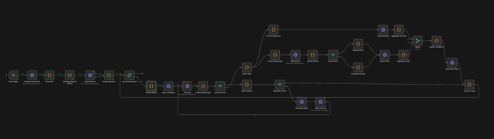

# M3 Incremental Clustering with KNN Similarity - Technical Overview

## Purpose
 Incremental article clustering system that uses KNN similarity search to decide whether new articles should merge with existing clusters or form new ones.  
 Also see: `M3_Clustering_Summary_Label.md` for the extended version with integrated summaries and labels.

---

## Core Flow

```
1. Fetch unclustered articles from OpenSearch
2. Process in batches through LLM (generates clusters + summaries)
3. For each cluster returned by LLM:
   ├─ KNN search against existing clusters (k=20, similarity threshold=0.75)
   ├─ If similarity >= 0.75: MERGE with existing cluster
   └─ If similarity < 0.75: CREATE new cluster
4. Save summaries and clusters to OpenSearch in parallel
5. Update batch status
```

---
## Visual



---
## Technical Details

### Data Sources
- **Input:** `articles` index (filters out already-clustered articles using `must_not` query)
- **KNN Search:** `clusters` index with `centroid_embedding` field (384-dim knn_vector, NMSLIB engine)
- **Output:** `article_summaries` and `clusters` indices

### LLM Integration
- **Endpoint:** `POST /cluster_create`
- **Returns:** `{ clusters: [...], article_summaries: {...} }`
- **Timeout:** 5 hours
- **Retry Logic:** On failure, splits batch in half (min 5 articles), max 3 retries

### KNN Similarity Decision
```javascript
// Search for similar clusters
KNN Query: {
  query: { knn: { centroid_embedding: { vector: [384-dim], k: 20 } } }
}

// Filter: status='active' && article_count >= 1
// Decision:
if (topMatch.score >= 0.75) {
  // MERGE
  merged_articles = dedupe([...existing.article_ids, ...new.article_ids])
  merged_centroid = average(existing.centroid, new.centroid)
  UPDATE existing cluster
} else {
  // CREATE
  INSERT new cluster
}
```

### Parallel Processing
After LLM returns data, two branches execute simultaneously:

**Branch A (Summaries):**
```
article_summaries object → convert to array → INSERT to article_summaries index → aggregate results
```

**Branch B (Clusters):**
```
clusters array → for each cluster:
  → KNN search → decide merge/create → INSERT/UPDATE clusters index → aggregate results
```

Both branches converge to update `llm_batch` status.

---

## Key Algorithms

### 1. Cluster Merging
```python
# Article deduplication
merged_ids = list(set(existing_ids + new_ids))

# Centroid averaging
for i in range(384):
    merged_embedding[i] = (existing[i] + new[i]) / 2

# Update metadata
article_count = len(merged_ids)
last_updated_at = now()
```

### 2. Embedding Validation
```python
# Ensure 384 dimensions
if len(embedding) < 384:
    embedding += [0.0] * (384 - len(embedding))  # Pad
elif len(embedding) > 384:
    embedding = embedding[:384]  # Truncate
```

### 3. Batch Retry Strategy
```python
def retry_logic(batch, retry_count):
    if retry_count >= 3:
        return SKIP
    
    new_size = max(5, len(batch) // 2)
    sub_batches = split(batch, size=new_size)
    
    for sub in sub_batches:
        retry(sub, retry_count + 1)
```

---

## Configuration

| Parameter | Value | Location |
|-----------|-------|----------|
| Similarity Threshold | 0.75 | Build OpenSearch Query |
| KNN k | 20 | KNN Search node |
| Embedding Dimensions | 384 | Process Response2 |
| Batch Size | 3 articles | Loop Over Batches |
| Max Retries | 3 | Split and Retry |
| Min Retry Size | 5 articles | Split and Retry |

---

## Data Structures

### Cluster Document
```json
{
  "_id": "n8n_incr_2026-01-31_0414_001_0",
  "cluster_id": "0",
  "article_ids": ["ntv-123", "ntv-456"],
  "article_count": 2,
  "centroid_embedding": [384 floats],
  "status": "active",
  "created_at": "ISO datetime",
  "last_updated_at": "ISO datetime"
}
```

### Article Summary Document
```json
{
  "_id": "ntv-123_summary",
  "article_id": "ntv-123",
  "summary": "text",
  "language": "en",
  "model": "gpt-4o-mini",
  "processed_at": "ISO datetime"
}
```

### Batch Tracking Document
```json
{
  "_id": "n8n_incr_2026-01-31_0414_001",
  "status": "completed",
  "article_count": 5,
  "article_summaries_count": 5,
  "clusters_count": 1,
  "retry_count": 0,
  "completed_at": "ISO datetime"
}
```

---

## Performance Characteristics

- **Throughput:** ~60 - 70 articles/hour (depends on LLM speed)
- **KNN Search:** O(log n) with HNSW index
- **Parallel Execution:** Summaries and clusters process simultaneously
- **Memory:** Batch size limits memory usage (30 articles/batch)
- **Fault Tolerance:** Automatic retry with exponential batch reduction

---

## Dependencies

- **n8n:** v2.4.6
- **OpenSearch:** NMSLIB engine for KNN
- **LLM Service:** Must return clusters with 384-dim embeddings
- **Indices:** `articles`, `clusters`, `article_summaries`, `llm_batch`

---

## Workflow Execution Path

```
START
  → Get clustered IDs
  → Build exclusion query
  → Fetch unclustered articles
  → Loop batches (3 articles each)
    → Prepare batch metadata
    → Call LLM service
    → Check for errors
      ├─ ERROR: Split batch → Retry (max 3x)
      └─ SUCCESS: 
          ├─ Process summaries → Insert to OpenSearch
          └─ Process clusters:
              → KNN search (each cluster)
              → Decide merge/create
              → Save cluster
    → Aggregate results (wait for both branches)
    → Update batch status
  → Continue to next batch
END
```

---

## Critical Implementation Notes

1. **NMSLIB Filter Limitation:** Cannot use filters in KNN query; must filter results in code
2. **Parallel Branch Sync:** Uses merge node to wait for all items before log
3. **Embedding Dimensions:** Must be exactly 384 (padding/truncation enforced)
4. **Batch Status Update:** Requires data from BOTH summary AND cluster aggregation nodes

---

## Error Handling

| Error Scenario | Handling Strategy |
|----------------|-------------------|
| LLM Timeout | Split batch in half, retry up to 3x |
| Invalid JSON | Skip item, log error |
| KNN Search Fail | Continue on fail, create new cluster |
| Missing Embedding | Pad with zeros to 384 dimensions |
| OpenSearch Insert Fail | Continue on fail, track in aggregation |

---

## Monitoring

**Key Metrics:**
- Batch completion rate: Check `llm_batch` index with `status: completed`
- Merge ratio: Count of merged vs. created clusters
- Retry frequency: Track `retry_count` field
- Processing time: `completed_at - ingested_at`

**Debug Logs:**
```
🔍 Cluster {id}: Found {n} matches
📊 Top match score: {score} (threshold: 0.75)
✅ MERGE: Similarity {score} >= 0.75
➕ CREATE: Similarity {score} < 0.75
🔀 MERGE: {a} + {b} = {c} articles
```

---

## Version
- **Workflow:** v5.0
- **File:** `M3_-_Incremental_Clustering_with_KNN_Similarity__1_.json`
- **Updated:** 2026-01-31
