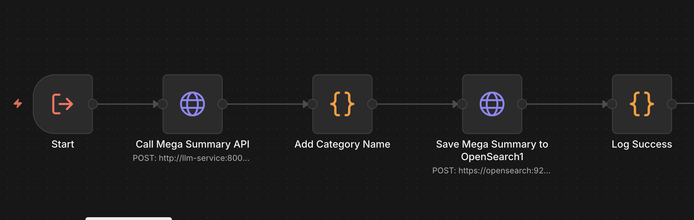

# M3 Mega Summary Sub-Workflow - Technical Overview

## Purpose
Sub-workflow that generates mega summaries from cluster summaries using LLM. Called by mega summary workflows to process individual category requests.

---

## Core Flow

```
1. Receive cluster summaries map and request_id
2. Call LLM mega_summarize endpoint
3. Extract category name from request_id
4. Add category name to response
5. Save mega summary to OpenSearch
6. Log success
```

---

## Visual Flow

```
START (Execute Workflow Trigger)
  → Call Mega Summary API (LLM /mega_summarize)
  → Add Category Name (extract from request_id)
  → Save Mega Summary to OpenSearch1
  → Log Success
END
```

Visual overview:



---

## Technical Details

### Input Format
This workflow is triggered by other workflows (sub-workflow). Expected input:
```json
{
  "cluster_summaries": {
    "0": "Summary for cluster 0...",
    "3": "Summary for cluster 3...",
    "7": "Summary for cluster 7..."
  },
  "request_id": "mega_Politics_1739277284328"
}
```

### LLM Integration
- **Endpoint:** `POST http://llm-service:8001/mega_summarize`
- **Payload:**
  ```json
  {
    "request_id": "mega_Politics_1739277284328",
    "cluster_summaries": {
      "0": "Summary for cluster 0...",
      "3": "Summary for cluster 3..."
    }
  }
  ```
- **Response:**
  ```json
  {
    "request_id": "mega_Politics_1739277284328",
    "mega_summary": "Comprehensive summary of all clusters...",
    "cluster_count": 3,
    "cluster_ids": ["0", "3", "7"],
    "processed_at": "2026-02-11T08:32:55.936Z"
  }
  ```
- **Timeout:** ~16.7 minutes (1000000ms)

### Category Name Extraction
- **Request ID Format:** `mega_{CATEGORY_NAME}_{TIMESTAMP}`
- **Extraction Logic:** Remove `mega_` prefix, remove trailing `_TIMESTAMP`
- **Example:** `mega_Politics_1739277284328` → `Politics`

### OpenSearch Save
```json
POST /mega_summaries/_doc
{
  "request_id": "mega_Politics_1739277284328",
  "category_name": "Politics",
  "mega_summary": "Comprehensive summary...",
  "cluster_count": 3,
  "cluster_ids": ["0", "3", "7"],
  "processed_at": "2026-02-11T08:32:55.936Z",
  "ingested_at": "2026-02-11T08:32:56.000Z"
}
```

---

## Configuration

| Parameter | Value | Location |
|-----------|-------|----------|
| LLM Timeout | ~16.7 minutes | Call Mega Summary API |
| Request ID Format | `mega_{CATEGORY}_{TIMESTAMP}` | Input from calling workflow |

---

## Data Structures

### Input (from calling workflow)
```json
{
  "cluster_summaries": {
    "0": "Summary for cluster 0...",
    "3": "Summary for cluster 3...",
    "7": "Summary for cluster 7..."
  },
  "request_id": "mega_Politics_1739277284328"
}
```

### Mega Summary API Response
```json
{
  "request_id": "mega_Politics_1739277284328",
  "mega_summary": "Comprehensive summary of all political clusters...",
  "cluster_count": 3,
  "cluster_ids": ["0", "3", "7"],
  "processed_at": "2026-02-11T08:32:55.936Z"
}
```

### Final Mega Summary Document
```json
{
  "request_id": "mega_Politics_1739277284328",
  "category_name": "Politics",
  "mega_summary": "Comprehensive summary of all political clusters...",
  "cluster_count": 3,
  "cluster_ids": ["0", "3", "7"],
  "processed_at": "2026-02-11T08:32:55.936Z",
  "ingested_at": "2026-02-11T08:32:56.000Z"
}
```

---

## Workflow Execution Path

```
START (Execute Workflow Trigger)
  → Call Mega Summary API
    ├─ Send cluster_summaries map to LLM
    └─ Receive mega summary response
  → Add Category Name
    ├─ Extract category from request_id
    └─ Combine with API response
  → Save Mega Summary to OpenSearch1
    └─ Create document in mega_summaries index
  → Log Success
    └─ Log document ID, category, result
END
```

---

## Critical Implementation Notes

1. **Sub-workflow Design:** Designed to be called by other workflows, not triggered directly
2. **Category Extraction:** Category name is extracted from request_id format, not passed separately
3. **Request ID Format:** Must follow `mega_{CATEGORY}_{TIMESTAMP}` pattern for category extraction
4. **Cluster Summaries Map:** Expects object with cluster_id as keys and summaries as values
5. **Document ID:** OpenSearch auto-generates document ID (not using request_id as _id)

---

## Error Handling

| Error Scenario | Handling Strategy |
|----------------|-------------------|
| LLM mega_summarize fails | Workflow fails, no mega summary saved |
| Missing cluster_summaries | LLM may return error or empty summary |
| Invalid request_id format | Category extraction may fail or return incorrect name |
| OpenSearch save fails | Workflow fails, document not saved |

---

## Monitoring

**Key Metrics:**
- Mega summary generation success: Check `mega_summaries` index for new documents
- Processing time: Compare `processed_at` vs `ingested_at` timestamps
- Category coverage: Count documents per category_name

**Debug Logs:**
```
✅ MEGA SUMMARY GENERATED
Category: Politics
Request ID: mega_Politics_1739277284328
Cluster count: 3
Mega summary length: 1234 chars
Processed at: 2026-02-11T08:32:55.936Z

💾 MEGA SUMMARY SAVED TO OPENSEARCH
Document ID: {auto_generated_id}
Index: mega_summaries
Category: Politics
Result: created
```

---

## Dependencies

- **n8n:** v2.4.6+
- **OpenSearch:** Index: `mega_summaries` (write)
- **LLM Service:** Must support `/mega_summarize` endpoint

---

## Integration Points

### Called By
- M3 - Mega Summary Workflow (`xprLf76Ve2AbQ5eH7-CLU`)
- Other workflows that need mega summary generation

### Calls
- None (standalone sub-workflow)

---

## Version
- **Workflow:** v1.0
- **File:** `ncmTMNFvPv5Jt8Sj.json`
- **Updated:** 2026-02-11
