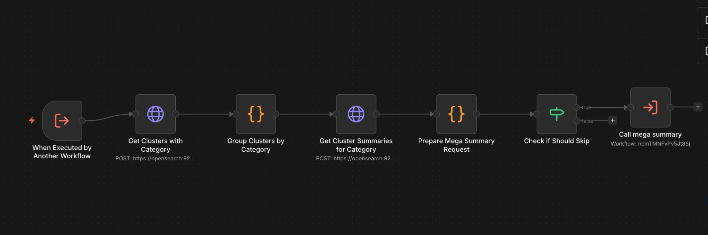

# M3 Mega Summary Workflow - Technical Overview

## Purpose
Main workflow that orchestrates mega summary generation for all categorized clusters. Groups clusters by category, fetches their summaries, and generates mega summaries for each category in parallel.  
Also see: `M3_Mega_Summary_Sub_Workflow.md` for the LLM-based per-category mega summary generation.

---

## Core Flow

```
1. Get all clusters with category field from OpenSearch
2. Group clusters by category
3. For each category (parallel):
   ├─ Fetch cluster summaries from cluster_summaries index
   ├─ Build cluster_summaries map
   ├─ Prepare mega summary request
   ├─ Check if should skip (no summaries found)
   └─ Call mega summary sub-workflow
4. Log completion
```

---

## Visual Flow

```
START (Manual trigger OR Execute Workflow Trigger)
  → Get Clusters with Category (OpenSearch query)
  → Group Clusters by Category (JavaScript grouping)
  → Get Cluster Summaries for Category (OpenSearch query per category)
  → Prepare Mega Summary Request (build map, create request_id)
  → Check if Should Skip (if no summaries found)
    ├─ IF skip: Stop processing this category
    └─ IF NOT skip: Call mega summary (sub-workflow)
END
```

Visual overview:



---

## Technical Details

### OpenSearch Queries

**Get Clusters with Category:**
```json
{
  "query": {
    "bool": {
      "must": [
        {
          "exists": {
            "field": "category"
          }
        }
      ]
    }
  },
  "_source": ["cluster_id", "category", "article_count"],
  "size": 10000
}
```

**Get Cluster Summaries for Category:**
```json
{
  "query": {
    "terms": {
      "cluster_id": ["0", "3", "7", ...]
    }
  },
  "_source": ["cluster_id", "summary"],
  "size": {cluster_ids.length}
}
```

### Category Grouping Logic
```javascript
// Groups clusters by category
const clustersByCategory = {};
clusters.forEach(cluster => {
  const category = cluster.category;
  if (!clustersByCategory[category]) {
    clustersByCategory[category] = {
      category_name: category,
      cluster_ids: [],
      cluster_count: 0
    };
  }
  clustersByCategory[category].cluster_ids.push(cluster.cluster_id);
  clustersByCategory[category].cluster_count++;
});
```

### Request ID Format
- **Pattern:** `mega_{CATEGORY_NAME}_{TIMESTAMP}`
- **Example:** `mega_Politics_1739277284328`
- **Purpose:** Used by sub-workflow to extract category name

### Skip Logic
- If no summaries found for a category's clusters, skip that category
- Prevents calling LLM with empty cluster_summaries map

---

## Configuration

| Parameter | Value | Location |
|-----------|-------|----------|
| Max Clusters Fetched | 10000 | Get Clusters with Category |
| Sub-workflow Wait | false (parallel) | Call mega summary |
| Skip if No Summaries | true | Check if Should Skip |

---

## Data Structures

### Clusters Query Response
```json
{
  "hits": {
    "hits": [
      {
        "_source": {
          "cluster_id": "0",
          "category": "Politics",
          "article_count": 5
        }
      },
      ...
    ],
    "total": {
      "value": 150
    }
  }
}
```

### Grouped Categories
```json
[
  {
    "category_name": "Politics",
    "cluster_ids": ["0", "3", "7"],
    "cluster_count": 3
  },
  {
    "category_name": "Technology",
    "cluster_ids": ["1", "5", "9"],
    "cluster_count": 3
  }
]
```

### Cluster Summaries Response
```json
{
  "hits": {
    "hits": [
      {
        "_source": {
          "cluster_id": "0",
          "summary": "Summary for cluster 0..."
        }
      },
      ...
    ]
  }
}
```

### Mega Summary Request Payload
```json
{
  "request_id": "mega_Politics_1739277284328",
  "category_name": "Politics",
  "cluster_ids": ["0", "3", "7"],
  "cluster_summaries": {
    "0": "Summary for cluster 0...",
    "3": "Summary for cluster 3...",
    "7": "Summary for cluster 7..."
  }
}
```

---

## Workflow Execution Path

```
START (Manual trigger OR Execute Workflow Trigger)
  → Get Clusters with Category
    └─ Query OpenSearch for all clusters with category field
  → Group Clusters by Category
    ├─ Process clusters array
    ├─ Group by category field
    └─ Create array of category objects
  → Get Cluster Summaries for Category (for each category in parallel)
    └─ Query cluster_summaries index for cluster IDs
  → Prepare Mega Summary Request
    ├─ Build cluster_summaries map from OpenSearch response
    ├─ Create request_id with category name
    └─ Check if summaries found
  → Check if Should Skip
    ├─ IF skip == true: Stop (no output)
    └─ IF skip == false: Continue
  → Call mega summary (sub-workflow)
    └─ Execute sub-workflow with cluster_summaries and request_id
END
```

---

## Critical Implementation Notes

1. **Parallel Processing:** Each category processes independently after grouping
2. **Category Extraction:** Request ID format includes category name for sub-workflow extraction
3. **Skip Logic:** Categories with no summaries are skipped to avoid LLM errors
4. **Sub-workflow Execution:** Uses `waitForSubWorkflow: false` for parallel execution
5. **Large Scale:** Can handle up to 10000 clusters across multiple categories

---

## Error Handling

| Error Scenario | Handling Strategy |
|----------------|-------------------|
| No clusters with category | Returns empty array, no processing |
| No summaries for category | Skip category, log warning |
| Missing cluster_id in summaries | Filtered out during map building |
| Sub-workflow fails | Continues with other categories (parallel execution) |
| OpenSearch query fails | Workflow fails at that step |

---

## Monitoring

**Key Metrics:**
- Categories processed: Count from grouped categories array
- Clusters per category: Check `cluster_count` in grouped data
- Summaries found: Compare requested vs found cluster summaries
- Mega summaries generated: Check `mega_summaries` index

**Debug Logs:**
```
📊 CLUSTERS GROUPED BY CATEGORY
Politics: 15 clusters
Technology: 8 clusters
Total categories: 2
Total clusters: 23

📋 PREPARING MEGA SUMMARY REQUEST
Category: Politics
Request ID: mega_Politics_1739277284328
Clusters requested: 15
Summaries found: 14
Missing summaries: 1
```

---

## Dependencies

- **n8n:** v2.4.6+
- **OpenSearch:** Indices: `clusters` (read), `cluster_summaries` (read)
- **Sub-workflow:** "mega summary" (ID: `ncmTMNFvPv5Jt8Sj`)
- **LLM Service:** Via sub-workflow `/mega_summarize` endpoint

---

## Integration Points

### Called By
- Manual trigger
- Other workflows that need mega summary generation

### Calls
- "mega summary" sub-workflow (`ncmTMNFvPv5Jt8Sj`)

---

## Version
- **Workflow:** v1.0
- **File:** `xprLf76Ve2AbQ5eH7-CLU.json`
- **Updated:** 2026-02-11
