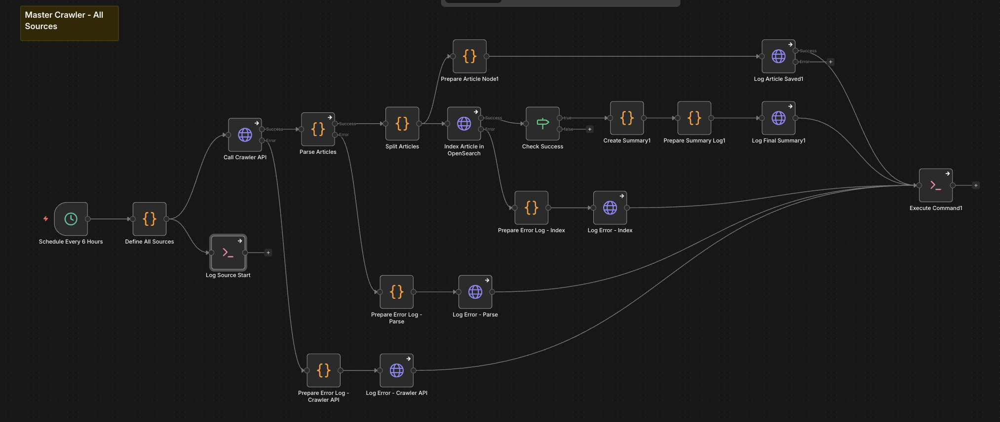

# M3 News Crawler - Technical Overview

## Purpose
Master crawler workflow that pulls articles from multiple news sources via the crawler API and indexes them into the `articles` index in OpenSearch, with detailed request/ingest logging.

---

## Core Flow

```
1. Define all news sources (CNN, Guardian, FAZ, NTV, etc.)
2. For each source (in parallel):
   ├─ Call crawler API endpoint for that source
   ├─ Parse and normalize returned articles
   ├─ Split articles into individual items
   ├─ Index each article into OpenSearch `articles` index
   ├─ Log per-article success / error to `articles_request`
3. After all articles are processed:
   ├─ Aggregate per-source statistics
   └─ Log a final crawl summary to `articles_request`
4. Run automatically on a schedule (every 6 hours)
```

---

## Visual Flow

```
Schedule Every 6 Hours
  → Define All Sources (list of source IDs, endpoints, language)
    → Call Crawler API (per source)
      → Parse Articles
        → Split Articles
          → Index Article in OpenSearch (articles index)
          → Prepare Article Node1 → Log Article Saved1 (articles_request)
      ↘ on error:
        → Prepare Error Log - Crawler API → Log Error - Crawler API

After indexing:
  → Check Success
    → Create Summary1 → Prepare Summary Log1 → Log Final Summary1
```

Visual overview:



---

## Technical Details

### Data Sources

- **Crawler API:** `http://crawler-api:8000/{endpoint}` (per source)
- **OpenSearch Indices:**
  - `articles` – canonical store for raw articles
  - `articles_request` – logs of crawl/index operations and summaries

### Sources

Defined in `Define All Sources` node, with fields:

- `id` – short source identifier (e.g., `cnn`, `guardian`, `faz`, `ntv`)
- `name` – human-readable name
- `endpoint` – crawler endpoint path (e.g., `southchinamorningpost/economics`)
- `language` – primary language (`en`, `de`, or `multi`)
- `run_id` – a shared timestamp-based ID for the whole crawl run

### Article Normalization

The `Parse Articles` and `Split Articles` nodes:

- Parse the crawler response (string or JSON) into an array of article objects.
- Generate a stable `_opensearch_id` based on source + URL/title/date.
- Normalize each article into:
  - `id` / `_opensearch_id`
  - `url`
  - `title`
  - `body` (or `description` fallback)
  - `language`
  - `source` / `crawler_source`
  - `published_at`
  - `run_id`, `retrieved_at`, and a small `_metadata` block.

### Indexing

Each normalized article is sent to:

```http
POST https://opensearch:9200/articles/_doc/{id}
```

Body fields:

- `title`, `body`, `language`, `source`, `published_at`, `id`, `url`
- `_metadata` with crawl-specific details

---

## Logging & Monitoring

### Per-Article Logs

For each article, `Prepare Article Node1` builds a `log_data` object and `Log Article Saved1` writes to `articles_request`:

- `request_id` – `{run_id}-{article_id_snippet}`
- `source` – `news_crawler`
- `endpoint` – `/crawl/{source}`
- `http_method` – `GET`
- `status` – `success` or `failed`
- `http_code` – `200` or error code
- `error_type`, `error_message` (on failure)
- `payload_excerpt` – article id, source, truncated title

### Error Logs

Three dedicated error paths:

- **Crawler API errors:**
  - `Prepare Error Log - Crawler API` → `Log Error - Crawler API`
  - Logs API-level failures (bad status, network errors, etc.).
- **Parsing errors:**
  - `Prepare Error Log - Parse` → `Log Error - Parse`
  - Logs failures when parsing or interpreting crawler responses.
- **Indexing errors:**
  - `Prepare Error Log - Index` → `Log Error - Index`
  - Logs OpenSearch indexing failures.

All error logs end up in `articles_request`.

### Run Summary

After indexing, `Create Summary1` aggregates:

- Total articles
- Successful vs failed
- Breakdown `by_source` (per crawler source)

`Prepare Summary Log1` wraps this into a `log_data` structure, and `Log Final Summary1` writes a final run-level record to `articles_request` with:

- `request_id` – `{run_id}-summary`
- `endpoint` – `/crawl/summary`
- `status` – `success` or `partial_success`
- `payload_excerpt` – per-source counts

There is also a simple file-based log at `/tmp/crawler/logs/master.log` used for quick debugging.

---

## Configuration

| Parameter              | Value                   | Location                     |
|------------------------|-------------------------|------------------------------|
| Schedule Interval      | Every 6 hours           | `Schedule Every 6 Hours`    |
| Crawler Timeout        | 5 minutes               | `Call Crawler API` options  |
| Max Sources per Run    | All defined in code     | `Define All Sources`        |
| Articles Index         | `articles`              | `Index Article in OpenSearch` |
| Logs Index             | `articles_request`      | All `Log *` nodes           |

---

## Workflow Execution Path

```
START (Schedule Every 6 Hours or manual)
  → Define All Sources
    → For each source:
       → Log Source Start (append to /tmp/crawler/logs/master.log)
       → Call Crawler API
          ├─ SUCCESS:
          │   → Parse Articles
          │     ├─ SUCCESS: Split Articles → (Index + Log per article)
          │     └─ ERROR: Prepare Error Log - Parse → Log Error - Parse
          └─ ERROR:
              → Prepare Error Log - Crawler API → Log Error - Crawler API
  → After indexing:
     → Check Success → Create Summary1 → Prepare Summary Log1 → Log Final Summary1
END
```

---

## Critical Implementation Notes

- **Idempotency:** Article IDs are derived from source + URL/title/date, helping avoid duplicates across runs.
- **Resilience:** All major stages have error branches that log failures but do not stop the entire crawl.
- **Language tagging:** Each article is tagged with a language from the source definition (`en`, `de`, `multi`), which later drives language-aware clustering/translation.
- **Run tracking:** `run_id` ties all article logs and the final summary together for a given crawl.

---

## Dependencies

- **n8n:** v2.4.6+
- **Crawler API:** Must be reachable at `crawler-api:8000`
- **OpenSearch:** Indices `articles` and `articles_request` must exist or be auto-created

---

## Version

- **Workflow:** M3 - News Crawler
- **Files:** `M3 - News Crawler.json`, `AtP3zRYU32PlpvMW0UdNn.json`
- **Updated:** 2026-02-11

