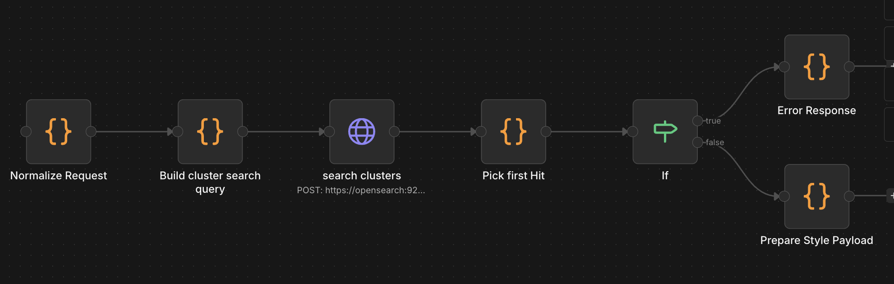

# M3 Summary Style Workflow - Technical Overview

## Purpose
Webhook endpoint that applies writing style and formatting to cluster summaries. Fetches a summary from OpenSearch based on category, then applies styling via LLM service.

---

## Core Flow

```
1. Receive webhook POST request with category and style parameters
2. Normalize request parameters (writing_style, output_format, institutional)
3. Search cluster_summaries index for matching category
4. Pick first matching summary
5. Check if summary exists
   ├─ YES: Prepare style payload → Call style endpoint → Return styled summary
   └─ NO: Return error response
6. Respond with styled summary
```

---

## Visual Flow

```
Webhook POST /webhook/style
  → Normalize Request
  → Build cluster search query
  → Search clusters (OpenSearch)
  → Pick first Hit
  → If (summary exists)
     ├─ YES: Prepare Style Payload → Call Style Endpoint → Prepare Update body → Respond
     └─ NO: Error Response → Respond
```

Visual overview:



---

## Technical Details

### Webhook Endpoint
- **Path:** `/webhook/style`
- **Method:** POST
- **Response:** JSON with styled summary

### Request Parameters

```json
{
  "category": "Politics",
  "writing_style": "Journalistic" | "Academic" | "Executive" | "LinkedIn",
  "output_format": "Paragraph" | "Bullet Point" | "TL;DR" | "Sections",
  "editorial_tone": "Institutional" | "Neutral" | "Default",
  "language": "en",
  "size": 1
}
```

### Style Mapping

**Writing Styles:**
- `Journalistic` → `journalistic`
- `Academic` → `academic`
- `Executive` → `executive`
- `LinkedIn` → `linkedin`

**Output Formats:**
- `Paragraph` → `paragraph`
- `Bullet Point` / `Bullet Points` → `bullet_points`
- `TLDR` → `tldr`
- `Sections` → `sections`

**Editorial Tone:**
- `Institutional` → `institutional: true`
- `Neutral` / `Default` → `institutional: false`

### OpenSearch Query

```json
{
  "size": 1,
  "_source": ["cluster_id", "summary", "processed_at", "category", "language"],
  "query": {
    "bool": {
      "must": [
        { "term": { "category": "Politics" }},
        { "exists": { "field": "summary" }}
      ]
    }
  },
  "sort": [{ "processed_at": { "order": "desc" }}]
}
```

### LLM Integration
- **Endpoint:** `POST http://llm-service:8001/summary_style`
- **Payload:**
  ```json
  {
    "request_id": "style_2026-02-11T10:43:50_0",
    "summary": "Original summary text...",
    "writing_style": "journalistic",
    "output_format": "bullet_points",
    "institutional": false
  }
  ```
- **Timeout:** 5 hours (18000000ms)

### Response Format

```json
{
  "styled_summary": "Styled and formatted summary text...",
  "request_id": "style_2026-02-11T10:43:50_0",
  "writing_style": "journalistic",
  "output_format": "bullet_points",
  "institutional": false,
  "processed_at": "2026-02-11T10:43:50.411Z"
}
```

---

## Configuration

| Parameter | Value | Location |
|-----------|-------|----------|
| Default Language | `en` | Normalize Request |
| Default Size | 1 | Build cluster search query |
| Style Timeout | 5 hours | Call Style Endpoint |
| Max Results | 1 | OpenSearch query |

---

## Data Structures

### Normalized Request
```json
{
  "category": "Politics",
  "language": "en",
  "size": 1,
  "params": {
    "writing_style": "journalistic",
    "output_format": "bullet_points",
    "institutional": false
  }
}
```

### Style Request Payload
```json
{
  "request_id": "style_2026-02-11T10:43:50_0",
  "summary": "Original summary text...",
  "writing_style": "journalistic",
  "output_format": "bullet_points",
  "institutional": false
}
```

### Error Response
```json
{
  "batches_processed": 0,
  "source_clusters": 0,
  "final_summary": "",
  "message": "No cluster summary found for this category",
  "all_clusters": [],
  "individual_summaries": []
}
```

---

## Workflow Execution Path

```
START (Webhook Trigger)
  → Normalize Request (validate and map parameters)
  → Build cluster search query (OpenSearch query for category)
  → Search clusters (execute query)
  → Pick first Hit (extract summary)
  → If (error exists)
     ├─ YES: Error Response → Respond to Webhook
     └─ NO: Prepare Style Payload → Call Style Endpoint → Prepare Update body → Respond to Webhook
END
```

---

## Critical Implementation Notes

1. **Category-Based Lookup:** Always searches `cluster_summaries` index by category
2. **First Match Only:** Uses first result from search (most recent by `processed_at`)
3. **Parameter Normalization:** Maps human-readable values to API format
4. **Error Handling:** Returns structured error if no summary found for category
5. **Timeout Handling:** Long timeout (5 hours) for LLM processing

---

## Error Handling

| Error Scenario | Handling Strategy |
|----------------|-------------------|
| Missing category | Throws error, stops processing |
| No summary found | Returns error response with message |
| Invalid writing_style | Maps to null, uses default |
| Invalid output_format | Maps to null, uses default |
| LLM timeout | Returns timeout error |

---

## Monitoring

**Key Metrics:**
- Webhook requests: Check n8n execution logs
- Success rate: Compare successful vs error responses
- Processing time: Check `processed_at` timestamps

**Debug Logs:**
```
Transformed request: {...}
```

---

## Dependencies

- **n8n:** v2.4.6+
- **OpenSearch:** Index: `cluster_summaries` (must have `category` field)
- **LLM Service:** Must support `/summary_style` endpoint

---

## Version
- **Workflow:** v1.0
- **File:** `854Jg3_83NQdqeiToIatJ.json`
- **Updated:** 2026-02-11
