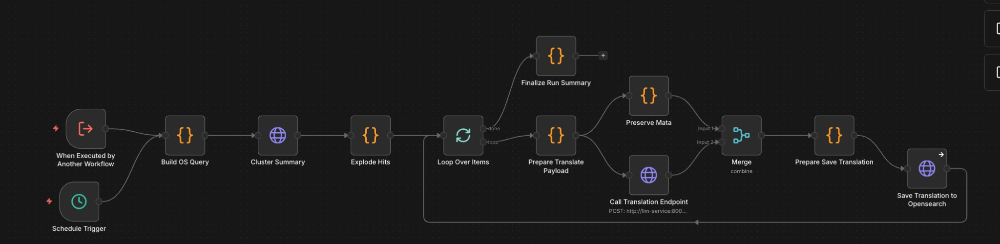

# M3 Translation Workflow - Technical Overview

## Purpose
Automated translation system that translates summaries, mega summaries, and categories from multiple OpenSearch indices from their source language to German (de).

---

## Core Flow

```
1. Build queries for multiple indices (cluster_summaries, mega_summaries, news_cluster_summaries, category_label)
2. Execute parallel searches across all indices
3. Extract documents that have source text but no translation yet
4. Process in batches (10 items per batch)
5. For each document:
   ├─ Prepare translation payload
   ├─ Call LLM translation endpoint
   └─ Save translated text back to OpenSearch
6. Log completion summary
```

Visual overview:



---

## Technical Details

### Data Sources
- **Input Indices:**
  - `cluster_summaries` → translates `summary` → `summary_translated`
  - `mega_summaries` → translates `mega_summary` → `mega_summary_translated`
  - `news_cluster_summaries` → translates `summary` → `summary_translated`
  - `category_label` → translates `category` → `category_translated`

- **Query Pattern:** Finds documents with source field present, sorted by `processed_at` descending
- **Target Language:** German (`de`)

### Translation Rules

Each index has specific field mappings:

```javascript
RULES = {
  cluster_summaries: {
    sourceField: "summary",
    targetField: "summary_translated",
    targetLangField: "summary_translated_language"
  },
  mega_summaries: {
    sourceField: "mega_summary",
    targetField: "mega_summary_translated",
    targetLangField: "mega_summary_translated_language"
  },
  news_cluster_summaries: {
    sourceField: "summary",
    targetField: "summary_translated",
    targetLangField: "summary_translated_language"
  },
  category_label: {
    sourceField: "category",
    targetField: "category_translated",
    targetLangField: "category_translated_language"
  }
}
```

### LLM Integration
- **Endpoint:** `POST http://llm-service:8001/translate_cluster_summary`
- **Payload Format:**
  ```json
  {
    "payload": {
      "cluster_summary": {
        "summary": "source text",
        "cluster_id": "0",
        "article_ids": ["id1", "id2"]
      }
    }
  }
  ```
- **Response:** Contains `summary_de` field with translated text
- **Timeout:** 5 hours (18000000ms)

### Translation Update Process

```javascript
// Update document in OpenSearch
POST /{index}/_update/{doc_id}
{
  "doc": {
    "{targetField}": "translated text",
    "{targetLangField}": "de",
    "translated_processed_at": "ISO datetime"
  },
  "doc_as_upsert": true
}
```

---

## Configuration

| Parameter | Value | Location |
|-----------|-------|----------|
| Batch Size | 10 items | Loop Over Items |
| Target Language | `de` (German) | Prepare Translate Payload |
| Max Results per Index | 1000 | Build OS Query |
| Translation Timeout | 5 hours | Call Translation Endpoint |

---

## Data Structures

### Translation Request
```json
{
  "meta": {
    "os_index": "cluster_summaries",
    "doc_id": "doc_123",
    "rule": {
      "sourceField": "summary",
      "targetField": "summary_translated",
      "targetLangField": "summary_translated_language"
    },
    "target_language": "de"
  },
  "payload": {
    "cluster_summary": {
      "summary": "Original English text...",
      "cluster_id": "0",
      "article_ids": ["id1", "id2"]
    }
  }
}
```

### Translation Response
```json
{
  "payload": {
    "cluster_summary": {
      "summary_de": "Übersetzter deutscher Text...",
      "cluster_id": "0"
    }
  }
}
```

### OpenSearch Update Document
```json
{
  "doc": {
    "summary_translated": "Übersetzter deutscher Text...",
    "summary_translated_language": "de",
    "translated_processed_at": "2026-02-11T10:43:50.411Z"
  },
  "doc_as_upsert": true
}
```

---

## Workflow Execution Path

```
START
  → Schedule Trigger (every 30 minutes) OR Manual/Workflow Trigger
  → Build OS Query (creates 4 parallel queries)
  → Cluster Summary (executes searches in parallel)
  → Explode Hits (flattens all results)
  → Loop Over Items (batch size: 10)
    → Prepare Translate Payload (extracts source text, builds request)
    → Call Translation Endpoint (LLM service)
    → Prepare Save Translation (extracts translated text)
    → Save Translation to Opensearch (updates document)
    → Continue loop
  → Finalize Run Summary (logs completion)
END
```

---

## Critical Implementation Notes

1. **Parallel Index Queries:** All 4 indices are queried simultaneously for efficiency
2. **Field Mapping:** Each index has its own rule for source/target field names
3. **Error Handling:** Uses `continueRegularOutput` on save failures to prevent workflow stop
4. **Batch Processing:** Processes 10 documents at a time to manage memory and API load
5. **Metadata Preservation:** Uses merge node to combine translation response with original metadata

---

## Error Handling

| Error Scenario | Handling Strategy |
|----------------|-------------------|
| Missing source field | Skip document, log error |
| Translation API timeout | Continue on fail, document skipped |
| Invalid doc_id | Throw error, stop processing that item |
| Missing translation in response | Throw error, stop processing that item |
| OpenSearch update fails | Continue on fail, log error |

---

## Monitoring

**Key Metrics:**
- Documents processed per run: Check logs for batch completion
- Translation success rate: Compare documents with `translated_processed_at` vs total
- Processing time: Check `translated_processed_at` timestamps

**Debug Logs:**
```
Translation workflow finished
Request ID: translation_run_2026-02-11T10-43-50
```

---

## Dependencies

- **n8n:** v2.4.6+
- **OpenSearch:** Indices: `cluster_summaries`, `mega_summaries`, `news_cluster_summaries`, `category_label`
- **LLM Service:** Must support `/translate_cluster_summary` endpoint

---

## Version
- **Workflow:** v1.0
- **File:** `4-1lq2GOUd_Tzxgw85mrb.json`
- **Updated:** 2026-02-11
