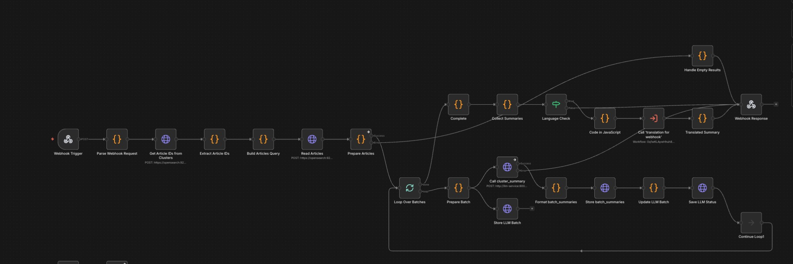
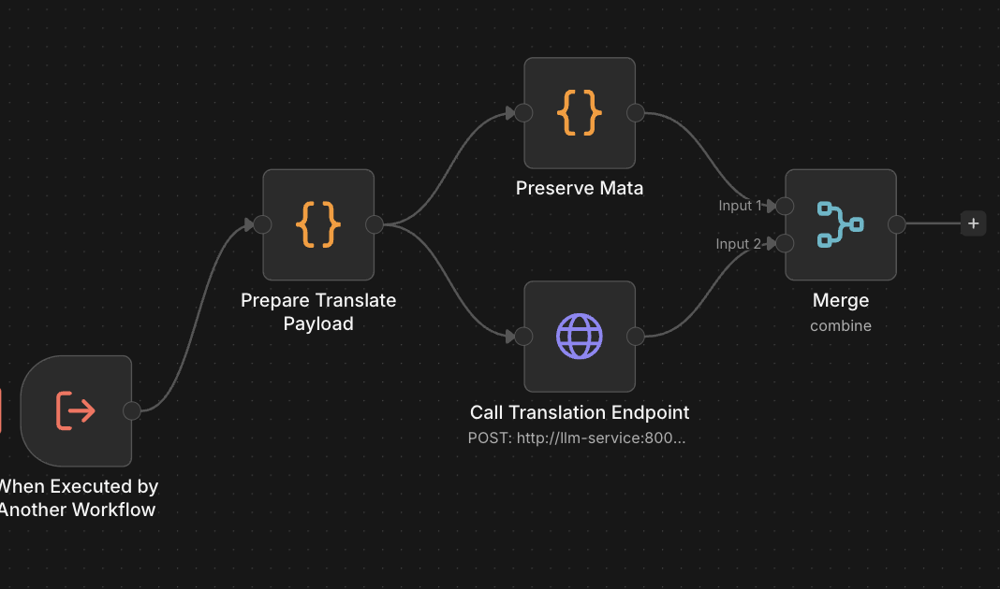

# M3 Webhook Cluster Summary - Technical Overview

## Purpose
Webhook endpoint that generates cluster summaries from article summaries based on filters (time window, category, keywords). Can use cluster-based filtering or direct article filtering.  
Also see: `M3_Incremental_Clustering_KNN.md` / `M3_Clustering_Summary_Label.md` for how clusters and summaries are produced upstream.

---

## Core Flow

```
1. Receive webhook POST request with filters
2. Parse request (time_window, category, keywords, etc.)
3. Optionally fetch article IDs from cluster_summaries index
4. Build query for article_summaries index
5. Fetch article summaries matching criteria
6. Process in batches (15 articles per batch)
7. For each batch:
   ├─ Call LLM cluster_summary endpoint
   ├─ Format batch_summaries response
   ├─ Store batch_summaries in OpenSearch
   └─ Update llm_batch status
8. Collect all summaries into a combined response object
9. If `request.body.language === "de"`:
   ├─ Call `translation for webhook` sub‑workflow
   └─ Replace `final_summary` with the translated German text (`summary_de`)
10. Return the final (original or translated) response to the caller
```

---

## Visual Flow

```
Webhook POST /webhook/cluster-summary
  → Parse Webhook Request
  → Get Article IDs from Clusters (if use_cluster_filter=true)
  → Extract Article IDs
  → Build Articles Query
  → Read Articles (article_summaries index)
  → Prepare Articles
  → Loop Over Batches (15 articles)
    → Prepare Batch
    → Store LLM Batch
    → Call cluster_summary (LLM)
    → Format batch_summaries
    → Store batch_summaries
    → Update LLM Batch
    → Save LLM Status
  → Collect Summaries
  → (if request.body.language === "de")
      → Call "translation for webhook" sub‑workflow
      → Replace final_summary with German translation (summary_de)
  → Webhook Response (JSON)
```

Visual overview:



---

## Technical Details

### Webhook Endpoint
- **Path:** `/webhook/cluster-summary`
- **Method:** POST
- **Response Mode:** JSON

### Request Parameters

```json
{
  "time_window": "last_24_hours" | "last_7_days" | etc.,
  "category": "Politics" | null,
  "subcategory": "Elections" | null,
  "keywords": ["keyword1", "keyword2"],
  "size": 1000,
  "use_cluster_filter": true | false,
  "style_version": "Neutral",
  "sentiment_target": "None"
}
```

### Filter Processing

**Time Window Options:**
- `last_6_hours` / `last_6h`
- `last_12_hours` / `last_12h`
- `last_24_hours` / `last_24h`
- `last_3_days` / `last_3d`
- `last_7_days` / `last_7d`

**Cluster Filter Mode:**
- If `use_cluster_filter=true`: Fetches article IDs from `cluster_summaries` matching the filters.
- If `use_cluster_filter=false`: Uses direct article filtering


### LLM Integration
- **Endpoint:** `POST http://llm-service:8001/cluster_summary`
- **Payload:**
  ```json
  {
    "articles": [...],
    "filters_used": {...},
    "request_id": "n8n_webhook_2026-02-11_1430_001"
  }
  ```
- **Timeout:** 15 minutes (900000ms)

### Translation Sub‑Workflow (`translation for webhook`)

When the webhook request includes `"language": "de"`:

- The **Language Check** node in the main webhook workflow evaluates `request.body.language === "de"`.
- On the **true** branch, it calls the sub‑workflow **`translation for webhook`** (see `translation for webhook.json`):
  - **Input:** The collected webhook result (including `final_summary` and `cluster_info`).
  - **Prepare Translate Payload:** Wraps `final_summary` into a `cluster_summary` payload:
    ```json
    {
      "payload": {
        "cluster_summary": {
          "summary": "<final_summary text>",
          "cluster_id": "<first cluster id | cluster_001>",
          "article_ids": []
        }
      }
    }
    ```
  - **Call Translation Endpoint:** `POST http://llm-service:8001/translate_cluster_summary` with that payload.
  - **LLM Response:** Expects `payload.cluster_summary.summary_de` as the translated German text.
  - The main workflow’s **Translated Summary** node then replaces `final_summary` in the webhook response with this `summary_de` value.

Sub‑workflow visual overview:



### Batch Processing
- **Batch Size:** 15 articles per batch
- **Max Articles:** 100 articles total (throws error if exceeded)
- **Request ID Format:** `n8n_webhook_YYYY-MM-DD_HHMM_XXX`

---

## Configuration

| Parameter | Value | Location |
|-----------|-------|----------|
| Batch Size | 15 articles | Loop Over Batches |
| Max Articles | 100 | Prepare Batch |
| Max Summary Length | 2000 chars | Prepare Articles |
| LLM Timeout | 15 minutes | Call cluster_summary |
| Default Size | 1000 | Parse Webhook Request |

---

## Data Structures

### Webhook Request
```json
{
  "time_window": "last_24_hours",
  "category": "Politics",
  "subcategory": "Elections",
  "keywords": ["election", "vote"],
  "size": 1000,
  "use_cluster_filter": true,
  "style_version": "Neutral",
  "sentiment_target": "None",
  "language": "en"
}
```

> **Translation:** If you send `"language": "de"` in the request body, the workflow will:
> - Run the standard English `cluster_summary` LLM flow.
> - Then call the **“translation for webhook”** sub‑workflow.
> - Replace the `final_summary` field in the response with the translated **German** summary (`summary_de`) returned by that sub‑workflow.

### Cluster Query (when use_cluster_filter=true)
```json
{
  "size": 1000,
  "_source": ["article_ids", "cluster_id", "request_id", "topic_label", "summary"],
  "query": {
    "bool": {
      "must": [
        { "range": { "processed_at": { "gte": "2026-02-10T14:30:00Z" }}},
        { "term": { "topic_label.keyword": "Elections" }}
      ]
    }
  },
  "sort": [{ "processed_at": { "order": "desc" }}]
}
```

### Article Summaries Query
```json
{
  "size": 1000,
  "_source": ["article_id", "id", "summary", "language", "processed_at"],
  "query": {
    "bool": {
      "must": [
        { "terms": { "article_id": ["id1", "id2", ...] }}
      ]
    }
  },
  "sort": [{ "processed_at": { "order": "desc" }}]
}
```

### Batch Summary Document
```json
{
  "_id": "n8n_webhook_2026-02-11_1430_001",
  "request_id": "n8n_webhook_2026-02-11_1430_001",
  "summary_type": "cluster_summary",
  "cluster_count": 3,
  "clusters": [...],
  "final_summary": "Combined summary text...",
  "final_summary_keyword": "cluster_summary",
  "ingested_at": "2026-02-11T14:30:00Z"
}
```

### Webhook Response
```json
{
  "success": true,
  "batches_processed": 2,
  "filters_applied": {...},
  "source_clusters": 5,
  "cluster_info": [...],
  "total_article_clusters": 3,
  "total_unique_articles": 25,
  "final_summary": "Combined summary...",
  "individual_summaries": [...],
  "all_clusters": [...],
  "processed_at": "2026-02-11T14:30:05Z"
}
```

---

## Workflow Execution Path

```
START (Webhook Trigger)
  → Parse Webhook Request
  → Get Article IDs from Clusters (if use_cluster_filter)
  → Extract Article IDs
  → Build Articles Query
  → Read Articles (OpenSearch)
  → Prepare Articles
    ├─ SUCCESS: Loop Over Batches
    └─ ERROR: Handle Empty Results → Webhook Response (error)
  
  FOR EACH BATCH:
    → Prepare Batch
    → Store LLM Batch (create tracking doc)
    → Call cluster_summary (LLM)
    → Format batch_summaries
    → Store batch_summaries (OpenSearch)
    → Update LLM Batch
    → Save LLM Status
  
  → Collect Summaries (aggregate all batches)
  → Webhook Response (success)
END
```

---

## Critical Implementation Notes

1. **Cluster Filter Mode:** When enabled, uses `cluster_summaries` to find article IDs first, then fetches those articles
2. **Article Distribution:** LLM clusters are evenly distributed with original articles (not LLM's article list)
3. **Summary Deduplication:** Uses first cluster's summary to avoid duplication
4. **Error Handling:** Empty results return structured error responses instead of failing
5. **Batch Tracking:** Each batch creates an `llm_batch` document for monitoring

---

## Error Handling

| Error Scenario | Handling Strategy |
|----------------|-------------------|
| No clusters found | Returns `NO_CLUSTERS_FOUND` error in response |
| No articles found | Returns `NO_ARTICLES_FOUND` error in response |
| No valid articles | Returns `NO_VALID_ARTICLES` error in response |
| Too many articles (>100) | Throws error, stops processing |
| LLM timeout | Uses `continueErrorOutput`, batch marked as failed |
| Missing summary field | Filters out, continues processing |

---

## Monitoring

**Key Metrics:**
- Webhook requests: Check n8n execution logs
- Batch completion: Query `llm_batch` index with `request_id` pattern
- Summary quality: Check `batch_summaries` index for `final_summary` length

**Debug Logs:**
```
📋 Found 25 unique article IDs from 5 clusters
📊 Processing 15 article summaries
✅ WEBHOOK BATCH 1: 15 articles from 5 clusters
📊 Total clusters after deduplication: 3
```

---

## Dependencies

- **n8n:** v2.4.6+
- **OpenSearch:** Indices: `cluster_summaries`, `article_summaries`, `batch_summaries`, `llm_batch`
- **LLM Service:** Must support `/cluster_summary` endpoint

---

## Version
- **Workflow:** v1.0
- **File:** `7PCQD8l17QBqNg0mmrtRP.json`
- **Updated:** 2026-02-11
